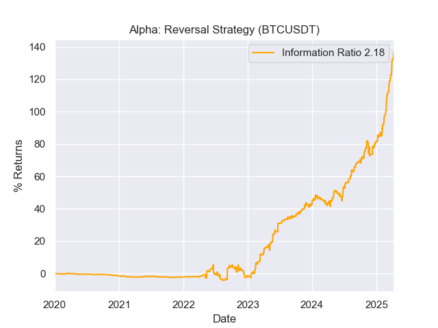
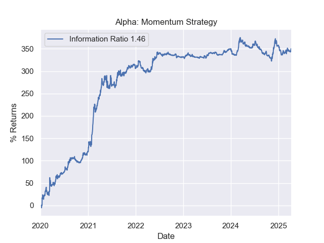
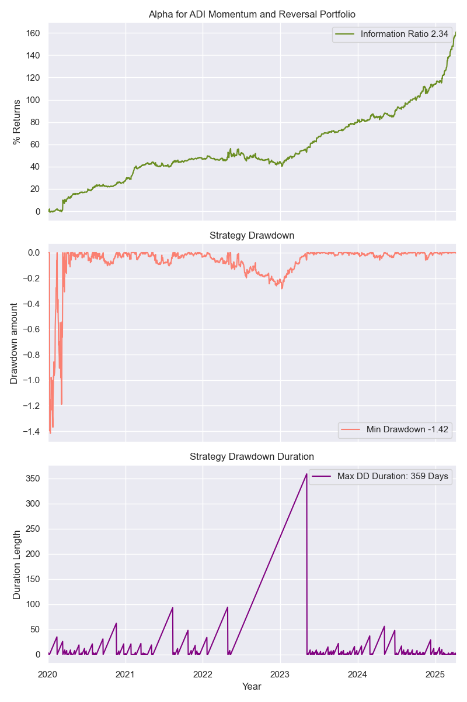
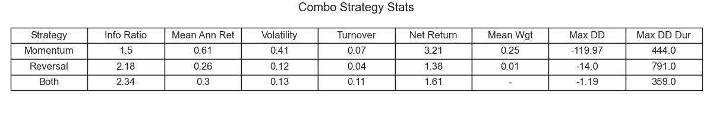

# Statistical Arbitrage in Crypto: Predicting Momentum and Reversal
### A Quant Strategy by Nathan T. Everett

Key:
1. Momentum strategy: Crypto Momentum Directional Index Strategy.ipynb
2. Reversal strategy: Correlated Basket Pair Reversal in Crypto.ipynb
3. Combo strategy: Directional Index Reveral and Momentum Strategy.ipynb

## Introduction
This project showcases two statistical arbitrage strategies and their combination into a single portfolio. These strategies use historical daily price data from Binance, using Binance python API. These dynamic signals aim to outperform passive buy-and-hold strategies. Both strategies utilize a trend indicator called Average Directional Index (ADI). This trend tends to predict when prices are showing momentum or reversal.

## Data Processing and Training Data
This portfolio uses historical daily high, low, and close price data from Binance, using Binance python API. The training data is split into a cross-sectional dataset utilizing randomly sampled high-market cap coins. A cross-sectional analysis is key to this strategy as different environments tend to show momentum and reversal at opposing times. Both data sets span January 2019 - April 2025. 

## Correlated Basket Pair Reversal
### Strategy
This strategy utilizes the idea that there is a general beta that drives crypto prices. When coins have a high correlation to one-another, they tend to be affected by the same beta strongly. When coins diverge from one another, then there is an arbitrage opportunity. Using a basket of coins, we can utilize these changes and amplify their effects. The basket is updated by a correlation on a rolling window. When coins are locally correlated, the arbitrage opportunity tends to be stronger. The reversal is done by finding the residual of the linear regressions of a basket of targets and a master coin. Note this is not a multiple regression, but the basket is a set of target variables on a the single independent (master) coin.

Finally, we use a trend indicator to determine whether or not we are in a reversal regime. A trend is found through a series of smoothed signals. When the direction of the trend is frequently changing, this indicated an environment that is beneficial for reversal.

### Performance
The dollar-neutral nature of this strategy made it's alpha very robust. It has a net sharpe of 2.22 and an information ratio of 2.18 when BTCUSDT is used as the master coin. A complete summary of performance can be found in table 1 below. The alpha displayed was purified using a beta of buy-and-hold strategy of the coins in the trading universe. Similar results are seen when the beta is assumed to be a single coin, like the master coin.

*Figure 1.* Alpha for a reversal strategy using BTCUSDT as a master coin.

## Momentum Directional Index Strategy 
### Strategy
This strategy uses the ADI trend indicator to find momentum environments in crypto. It utilizes big market cap coins which are more robust to trend prediction due to their large trading volume. Two moving averages of the price data with different time horizons are measured against each other. When the two averages cross, then a momentum signal is made. If no signal is detected, the position is kept. However, the signal only changes the position if a trend is also detected with the ADI. Due to the nature of this signal, it is not a dollar-neutral portfolio and it will be net-long or net-short at any given period.

### Performance
This strategy benefits from a strong bull or bear market. In 2020-2022 there was a strong bull rush in the new(ish) crypto market. This strategy seems to capture this well. It has a net sharp of 1.59 and an information ratio of 1.46. A complete summary of performance can be found in table 1 below. The alpha displayed was purified using a beta of buy-and-hold strategy of the coins in the trading universe.

*Figure 2.* Alpha for momentum strategy using high market cap coins.

## Combo Strategy
### Weighting
The combination of the above strategy was done using equal information ratio weighting. This was chosen to eliminate outliers from when the reversal strategy is "turned off." The weights were calculated taking the variance and the mean from a one-year rolling window. 

### Performance
The combination of the two strategies lead to continual returns. It has an information ratio of 2.34 and benefits from a lower drawdown and lower drawdown duration than either of the other two strategies. The turnover of all strategies are fairly modest, leading to solid net returns.

*Figure 3.* a. The alpha of the combined momentum and reversal strategies. b. The drawdown profile of the strategy. c. Duration of the drawdowns.

*Table 1.* The results and statistics of all each strategy and the combination strategy.

## Conclusion
The combination of these strategies yields strong returns while remaining market neutral. The combination has a strong alpha with minimal drawdown. One concern with this strategy is the number of free parameters. There are many parameters to choose and if one over-optimizes this is likely to be over-fit. However, the performance from the out-of-sample testing is in strong agreement with the full sample dataset.
